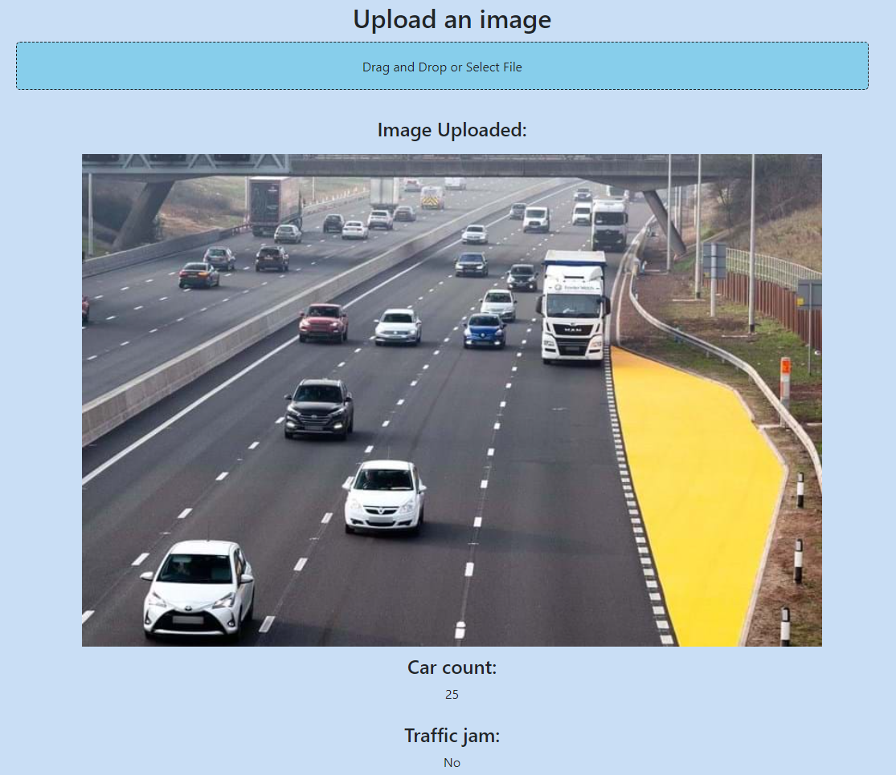

# LTA Traffic Density Prediction App

LTA Traffic Density Prediction App is a real-time Singapore traffic density prediction app. Simply run the app, and you will be able to get accurate and precise data.

## How to start the app
To use the app, do the steps below:
1. Download the files to your local folder
2. Open your Docker Desktop application
3. Go to the `lta-traffic-densitRun` and run `docker compose up` on the root directory
4. Wait for the build to finish
5. When the build is finished, wait 3 minutes for the app to run

## App Overview 

### Get real-time vehicle count on points accross Singapore
In this map, you can simply hover above it to get the overall density in various points in Singapore

### Pick a camera and see the latest image
You can pick out of 87 cameras across Singapore to get the most recent image as well as its predicted traffic condition

### Monitor the last 30 minutes traffic density
From this graph, you can see the changes in the recent traffic density

### Upload your own image for prediction
Or even better, you can upload **your own traffic image** to get the prediction.
